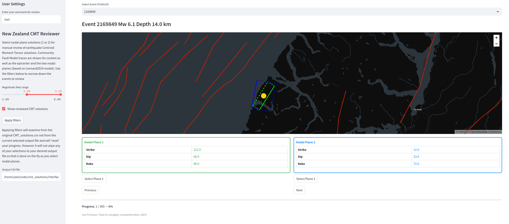

# CMT Reviewer — User Guide

This guide explains how to install and run the Streamlit CMT reviewer app and how to review nodal planes.

## 1. Prerequisites

- Python 3.8+ (use the same Python environment when running Streamlit as when you install the package).
- A virtual environment is recommended.
- Install development requirements listed in `requirements.txt` (or adjust to your environment).

## 2. Run the app

Change into the `interfaces` directory and run Streamlit:

```bash
cd interfaces
streamlit run cmt_reviewer.py
```

Open the URL printed by Streamlit (typically `http://localhost:8501`)

The application window should appear in your web browser and look similar to the screenshot below after you have entered your username:


## 3. App walkthrough — left column (filters & settings)

1. Enter your username in the "User Settings" box — this will be recorded in the review results so we know who performed each review. (e.g. Joel or Jake).
2. Choose a magnitude (Mw) range using the slider. By default the lower bound is set to Mw = 5.0 to focus on larger events.
3. Toggle "Show reviewed CMT solutions" to include events that have already been reviewed (useful for re-checking).
4. Confirm or change the output CSV file path where your reviewed results will be saved. The app writes the full working table (including your `reviewed` and `reviewer` columns) to this file as you select planes.
5. Click "Apply filters" to apply the magnitude/feedback filters. Note: applying filters resets the review scanning list back to the original dataset (it does not wipe the output file).

## 4. App walkthrough — right column (review panel)

1. Use the dropdown at the top to jump to a particular event (by `PublicID`) or use the `Previous`/`Next` buttons to step through the filtered list.
2. The map shows:
   - Two nodal planes: one in green and one in blue (these are the two possible fault planes for the seismic mechanism).
   - A yellow circle at the epicenter/hypocenter.
   - Red lines showing Community Fault Model traces; hover over a trace to see its name, dip ranges, dip direction and rake ranges.
3. The two panels on the right show the numeric strike/dip/rake for each nodal plane. Choose the plane you believe is the correct fault plane by clicking "Select Plane 1" or "Select Plane 2".
4. After selecting a plane:
   - The selected plane is written into `strike1`/`dip1`/`rake1` in the working table, and the other plane is written into `strike2`/`dip2`/`rake2`.
   - The row gets marked `reviewed = True` and `reviewer` is set to the username you entered.
   - The full working table is saved to the output CSV you specified.
   - The app automatically advances to the next event in the filtered list (unless you were already at the last event).
5. You can still navigate with the `Previous` and `Next` buttons at any time to re-check earlier events.
6. A progress bar at the bottom shows how far you are through the current filtered list.


## 5. After reviewing

When you've finished reviewing (or at any intermediate point) the output CSV contains the full working table and can be used to update the canonical `CMT_solutions.csv` used by this project.

To contribute your reviewed results back into the repository:

1. Replace `data/CMT_solutions.csv` (or `CMT_solutions.csv` in the appropriate location) with your reviewed CSV (The columns should match as long as your using the application).
2. Create a branch and open a pull request adding your reviewed CSV and describing the review (who, when, filters used).